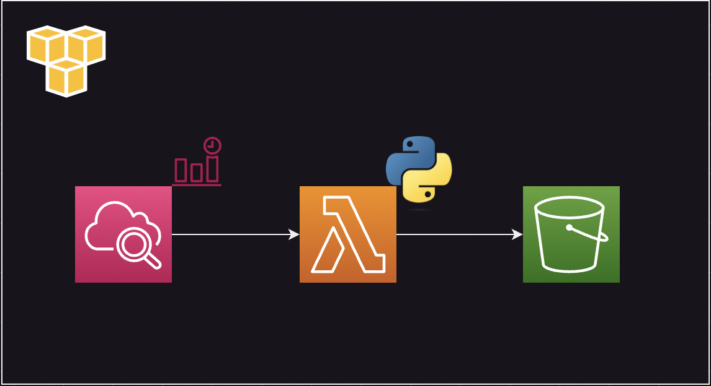
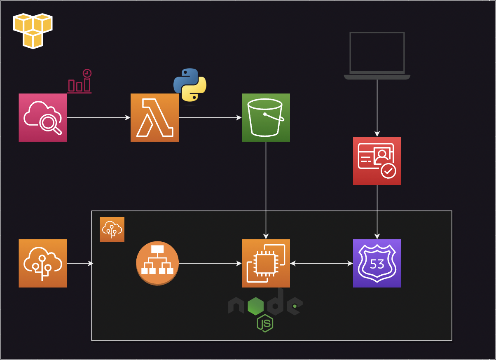
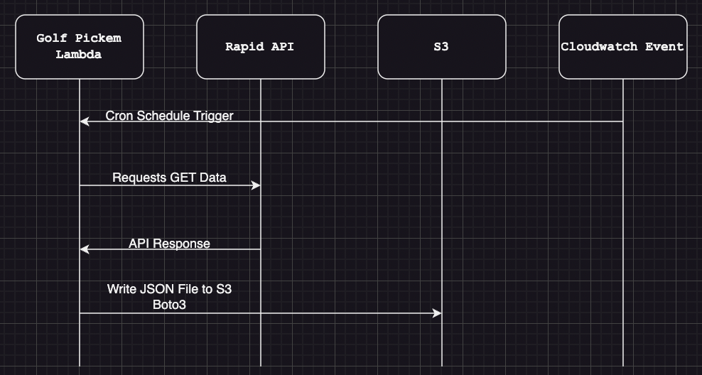

# Golf Data Helper Lambda

This repo contains python code for the purpose of making an API call to the Golf Leaderboard API to retrieve up to date data on a given Golf Tournament and publishing that data as a JSON file to an S3 bucket 

## Architecture

This is a basic Lambda that will be scheduled using cron jobs (Amazon Cloudwatch Event) to run the python script to make a GET request to the Golf Leaderboard Data API hosted on RapidAPI, create a JSON file, and finally load the file into Amazon S3. The front-end for this project will then be able to pull the JSON file from S3 in order to acquire up to date data for the end user.  
This architecture was chosen to limit calls to RapidAPI and stay within the free tier of the API subscription.

> *Lambda Architecture Diagram*

> *Application Architecture Diagram*

> *Logical Flow Diagram*

## Deployment Pipeline

#### Github Actions

#### Unit Test

#### Acceptance Test
TBD